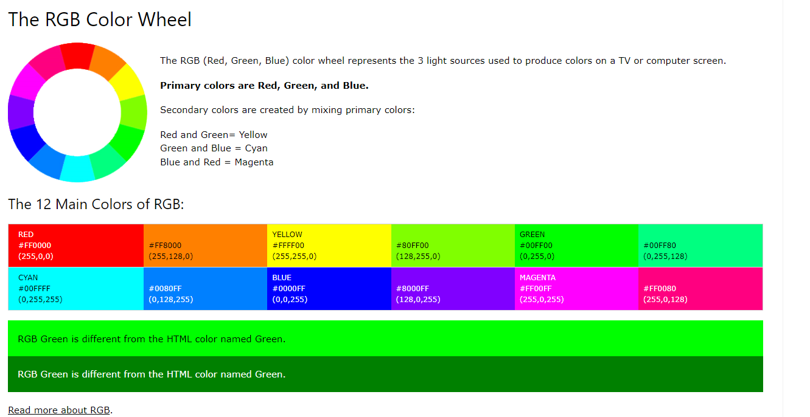
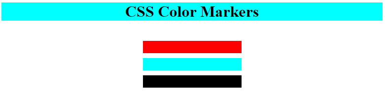

## Learn CSS Colors by Building a Set of Colored Markers

            • Selecting the correct colors for your webpage can greatly improve the aesthetic appeal to your readers. In this project, you'll  learn a set of colored markers. You'll learn different ways to set color values and how to pair colors with each other. You'll find step by step directions at this project to better undertake the coloring concept at the CSS.
                □ As you've seen in the previous projects, webpages should start with a DOCTYPE html declaration, followed by an html element.
                □ Nest a head element within the html element. Just after the head element, add a body element.
                □ Remember that the title element gives search engines extra information about the page. It also displays the content of that title element in two more ways:
                
                    ® in the title bar when the page is open
                    ® in the browser tab for the page when you hover on it. Even if that tab is not active, once you hover on the tab, the title text is displayed.
                
                □ To tell browsers how to encode characters on your page, set the charset to utf-8. utf-8 is a universal character set that includes almost every character from all human languages.
                
                Inside the head element, nest a meta element with the attribute charset set to utf-8. Remember that meta elements are self-closing, and do not need a closing tag.
                □ You can have multiple self-closing meta elements on a web page. Each meta element adds information about the page that cannot be expressed by other HTML elements.
                
                □ Add another self-closing meta element within the head. Give it a name attribute set to viewport and a content attribute set to width=device-width, initial-scale=1.0 so your page looks the same on all devices.
                □ Now you're ready to start adding content to the page.
                
                Within the body, nest an h1 element with the text CSS Color Markers.
                
                □ In this project you'll work with an external CSS file to style the page. You need to create a you-name-it.css file Before you can use it, you'll need to link it to the page.
                
                Nest a link element within the head element. Give it a rel attribute set to stylesheet and an href attribute set to you-name-it.css
                
                □ Now you'll add some elements that you'll eventually style into color markers.
                
                First, within the body element, add a div element and set its class attribute to container. Make sure the div element is below the h1 element.
                □ Next, within the div element, add another div element and give it a class of marker.
                □ It's time to add some color to the marker. Remember that one way to add color to an element is to use a color keyword like black, cyan, or yellow.
                
                As a reminder, here's how to target the class freecodecamp:
                
                .freecodecamp {
                  
                }
                Create a new CSS rule that targets the class marker, and set its background-color property to red.
                
                Note: You will not see any changes after adding the CSS.
                
                □ The background color was applied, but since the marker div element has no content in it, it doesn't have any height by default.
                
                In your .marker CSS rule, set the height property to 25px and the width property to 200px
                □ Your marker would look better if it was centered on the page. An easy way to do that is with the margin shorthand property.
                
                In the last project, you set the margin area of elements separately with properties like margin-top and margin-left. The margin shorthand property makes it easy to set multiple margin areas at the same time.
                
                To center your marker on the page, set its margin property to auto. This sets margin-top, margin-right, margin-bottom, and margin-left all to auto.
                □ Now that you've got one marker centered with color, it's time to add the other markers.
                
                In the container div, add two more div elements and give them each a class of marker.
                
                □ While you have three separate marker div elements, they look like one big rectangle. You should add some space between them to make it easier to see each element.
                
                When the shorthand margin property has two values, it sets margin-top and margin-bottom to the first value, and margin-left and margin-right to the second value.
                
                In your .marker CSS rule, set the margin property to 10px auto.
                
                □ To give the markers different colors, you will need to add a unique class to each one. Multiple classes can be added to an element by listing them in the class attribute and separating them with a space. For example, the following adds both the animal and dog classes to a div element.
                
                

                If you add multiple classes to an HTML element, the styles of the first classes you list may be overridden by later classes.
                
                To begin, add the class one to the first marker div element.
        
                □ There are two main color models: the additive RGB (red, green, blue) model used in electronic devices, and the subtractive CMYK (cyan, magenta, yellow, black) model used in print.
                
                In this project, you'll work with the RGB model. This means that colors begin as black, and change as different levels of red, green, and blue are introduced. An easy way to see this is with the CSS rgb function.
                
                Create a new CSS rule that targets the class container and set its background-color to black with rgb(0, 0, 0).
                □ A function is a piece of code that can take an input and perform a specific action. The CSS rgb function accepts values, or arguments, for red, green, and blue, and produces a color:
                
                rgb(red, green, blue);
                Each red, green, and blue value is a number from 0 to 255. 0 means that there's 0% of that color, and is black. 255 means that there's 100% of that color.
                
                In the .one CSS rule, replace the color keyword red with the rgb function. For the rgb function, set the value for red to 255, the value for green to 0, and the value for blue to 0.
                
                □ Notice that the background-color for your marker is still red. This is because you set the red value of the rgb function to the max of 255, or 100% red, and set both the green and blue values to 0.
                
                Now use the rgb function to set the other colors.
                
                In the .two CSS rule, use the rgb function to set the background-color to the max value for green, and 0 for the other values. And in the .three CSS rule, use the rgb function to set the background-color to the max value for blue, and 0 for the other values.
                
                □ While the red and blue markers look the same, the green one is much lighter than it was before. This is because the green color keyword is actually a darker shade, and is about halfway between black and the maximum value for green.
                
                In the .two CSS rule, set the green value in the rgb function to 127 to lower its intensity.
                
                □ Now add a little more vertical space between your markers and the edge of the container element they're in.
                In the .container CSS rule, use the shorthand padding property to add 10px of top and bottom padding, and set the left and right padding to 0. This works similarly to the shorthand margin property you used earlier.
                
                □ In the additive RGB color model, primary colors are colors that, when combined, create pure white. But for this to happen, each color needs to be at its highest intensity.
                
                Before you combine colors, set your green marker back to pure green. For the rgb function in the .two CSS rule, set green back to the max value of 255.
                
                
                □ Now that you have the primary RGB colors, it's time to combine them.
                
                For the rgb function in the .container rule, set the red, green, and blue values to the max of 255.
                
                □ Secondary colors are the colors you get when you combine primary colors. You might have noticed some secondary colors in the last step as you changed the red, green, and blue values.
                
                To create the first secondary color, yellow, update the rgb function in the .one CSS rule to combine pure red and pure green.
                
                □ To create the next secondary color, cyan, update the rgb function in the .two CSS rule to combine pure green and pure blue.
                □ To create the final secondary color, magenta, update the rgb function in the .three CSS rule to combine pure blue and pure red..
                □ Now that you're familiar with secondary colors, you'll learn how to create tertiary colors. Tertiary colors are created by combining a primary with a nearby secondary color.
                
                To create the tertiary color orange, update the rgb function in the .one CSS rule so that red is at the max value, and set green to 127.
                
                □ Notice that, to create orange, you had to increase the intensity of red and decrease the intensity of the green rgb values. This is because orange is the combination of red and yellow.
                
                To create the tertiary color spring green, combine cyan with green. Update the rgb function in the .two CSS rule so that green is at the max value, and set blue to 127.
                
                □ And to create the tertiary color violet, combine magenta with blue. Update the rgb function in the .three CSS rule so that blue is at the max value, and set red to 127.
            
                □ There are three more tertiary colors: chartreuse green (green + yellow), azure (blue + cyan), and rose (red + magenta).
                
                To create chartreuse green, update the rgb function in the .one CSS rule so that red is at 127, and set green to the max value.
                
                For azure, update the rgb function in the .two CSS rule so that green is at 127 and blue is at the max value.
                
                And for rose, which is sometimes called bright pink, update the rgb function in the .three CSS rule so that blue is at 127 and red is at the max value.
            
            
                Now that you've gone through all the primary, secondary, and tertiary colors on a color wheel, it'll be easier to understand other color theory concepts and how they impact design.
                
                First, in the CSS rules .one, .two, and .three, adjust the values in the rgb function so that the background-color of each element is set to pure black. Remember that the rgb function uses the additive color model, where colors start as black and change as the values of red, green, and blue increase.
                
                
                A color wheel is a circle where similar colors, or hues, are near each other, and different ones are further apart. For example, pure red is between the hues rose and orange.
                
                Two colors that are opposite from each other on the color wheel are called complementary colors. If two complementary colors are combined, they produce gray. But when they are placed side-by-side, these colors produce strong visual contrast and appear brighter.
                
                In the rgb function for the .one CSS rule, set the red value to the max of 255 to produce pure red. In the rgb function for .two CSS rule, set the values for green and blue to the max of 255 to produce cyan.
                
                Notice that the red and cyan colors are very bright right next to each other. This contrast can be distracting if it's overused on a website, and can make text hard to read if it's placed on a complementary-colored background.
                
                It's better practice to choose one color as the dominant color, and use its complementary color as an accent to bring attention to certain content on the page.
                
                First, in the h1 rule, use the rgb function to set its background-color to cyan.
                          
